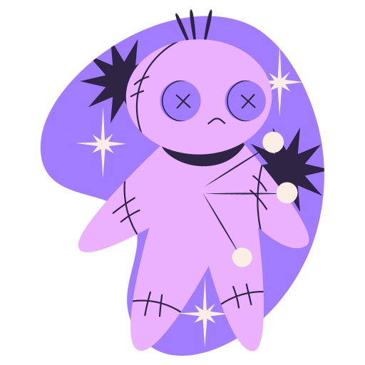

  

  <h1>Bem-vindo ao meu perfil!</h1>
  
Me chamo Mônica, sou desenvolvedora Fullstack com um foco especial no Frontend. Atualmente, estou aprofundando meus conhecimentos em Análise e Desenvolvimento de Sistemas.Minha jornada na tecnologia começou na adolescência e ganhou força a partir de 2021. Tenho paixão por inovação tecnológica e design, e estou sempre em busca de novos desafios e oportunidades de aprimoramento.

Feito com 💜 por <a href="https://github.com/MonicaAlvesP?tab=repositories">MA</a>.

